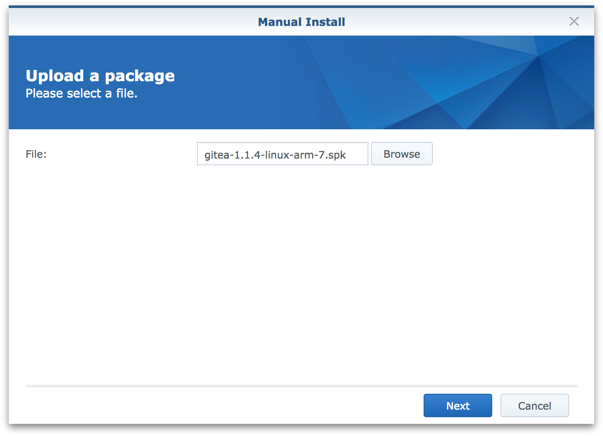
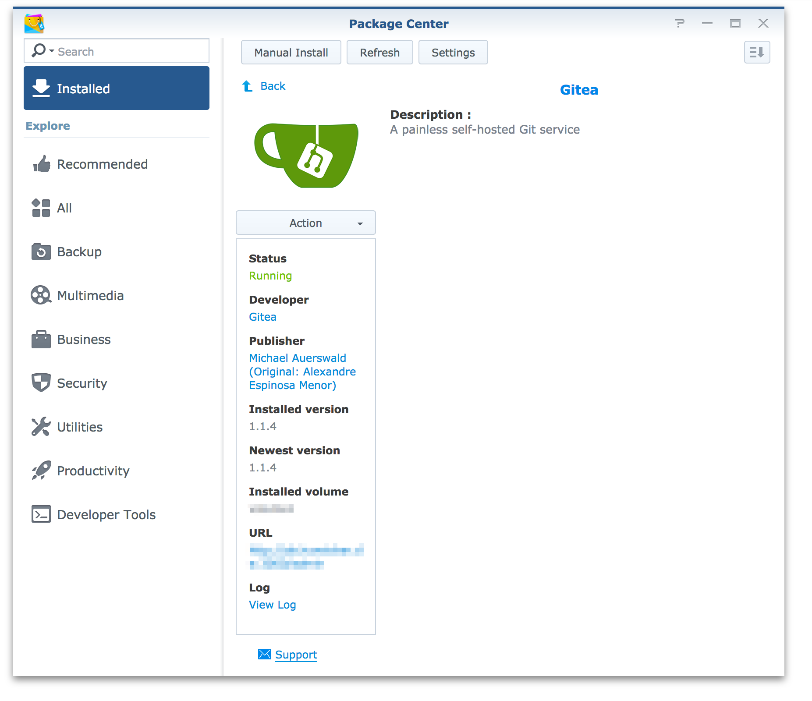

# gitea-spk

Fork [flipswitchingmonkey](https://github.com/flipswitchingmonkey/gitea-spk) to create a SPK package for [Gitea](https://github.com/go-gitea/gitea), a [Gogs](https://gogs.io/) fork.

This version uses [Docker](https://www.docker.com) to run the creation script.

### Dependencies

The Gitea package requires the **[Git Server](https://www.synology.com/en-global/dsm/packages/Git)** package.

### Package creation

To create the package, clone the repository:

`$ git clone https://github.com/rene-d/gitea-spk.git`

Change into the newly created directory:

`$ cd gitea-spk`

Get the download link for the binary matching your architecture from https://github.com/go-gitea/gitea/releases. For example, a DiskStation with an ARMv7 CPU would require:

`gitea-1.11.1-linux-arm-6`

Invoke the build script to have the package created:

`$ ./create.sh <url>`

The install package matching your binary (here `gitea-1.11.1-linux-arm-6.spk`) will be created in the current directory.

### Installation

Make sure **Package Center > Settings > General > Trust Level** is set to **Any Publisher** and perform installation via **Package Center > Manual Install**.

The installer will create the (internal) user/group gitea:gitea when not found and the executable is run with this user.

When installation has finished, the package center shows url and status of your Gitea server.

When accessed for the first time, Gitea will greet you with the installation settings. You should set your **Repository Root Path** to a shared folder. You can configure permissions for shared folders in the control panel via **Edit > Permissions > System internal user** to grant the Gitea user permission.

Tested to work on DS116 with Gitea 1.0.1.

### Acknowledgements

Original code copyright (c) 2016 Alexandre Espinosa Menor.

Michael Auerswald for Gitea version.
